<h1>TUTORIAL FLAPPY BIRD 🧾</h1>

<h1>INSTALAÇÃO GODOT 4.0.3 🧾</h1>
Instale a versão 4.0.3 d Godot Engine:
https://godotengine.org/download/windows/

<h1>CRIAÇÃO DO PROJETO 🧾</h1>
1- Crie um projeto no github e clone na sua máquina;

2- Ao iniciar o projeto, clique na aba "Novo Projeto", e insira o caminho do repositório no caminho do projeto;
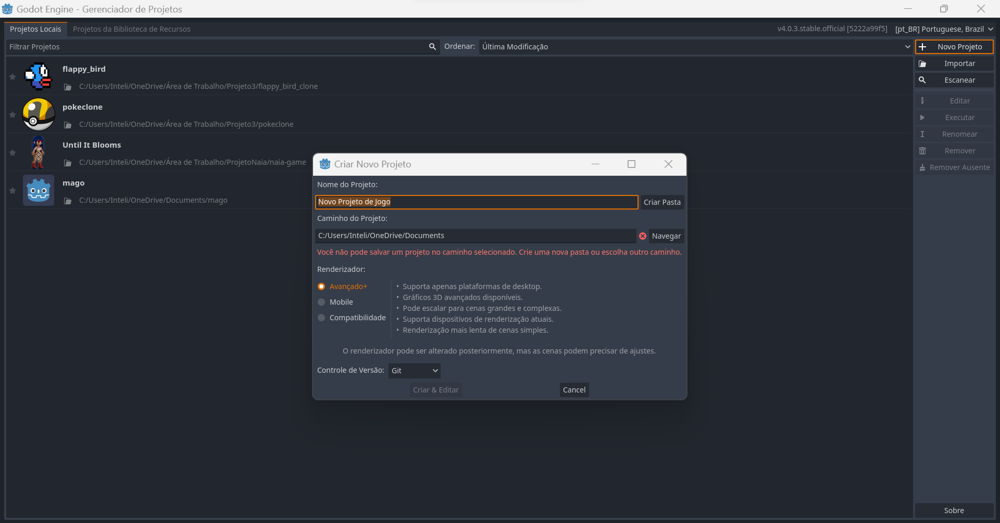


<h1>CRIAÇÃO DA ESTRUTURA DE PASTAS🧾</h1>
1- A estruturação do seu projeto deve seguir o seguinte exemplo:
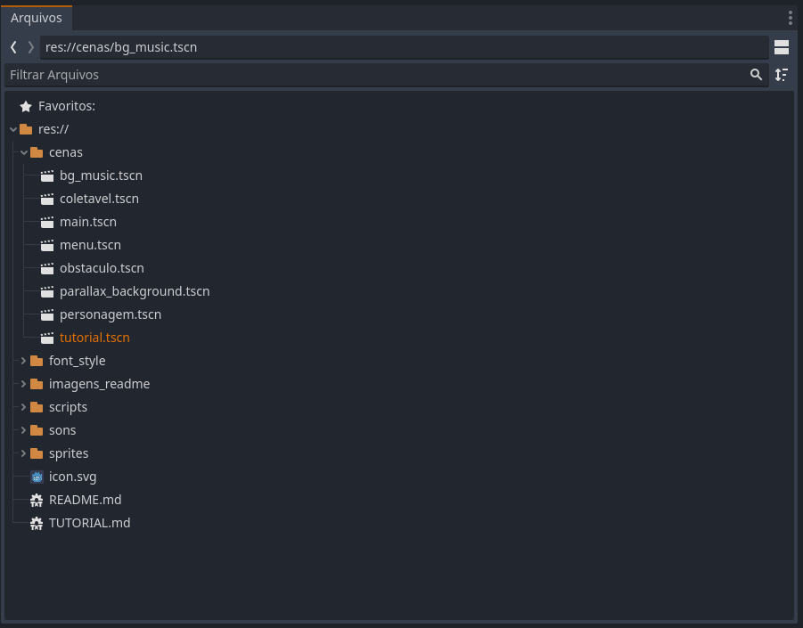

2- Dentro da aba scripts, crie um novo script chamado Global.gd

3- Abra a aba projeto, no canto superior esquerdo, e vá na opção Autoload
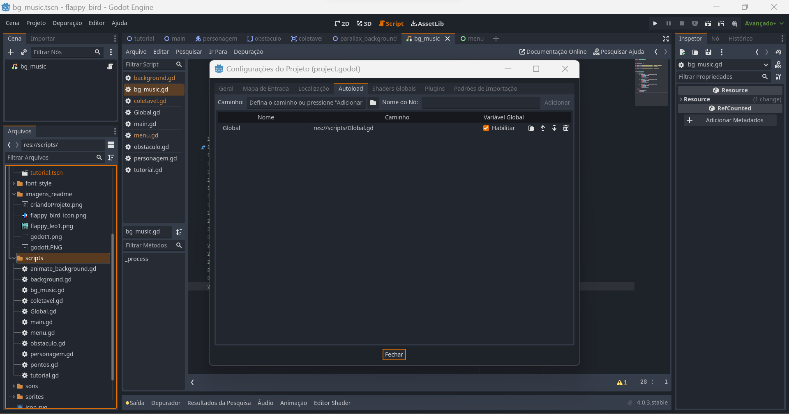

4- procure o ícone  e selecione o arquivo Global.gd, que está dentro da pasta scripts

Nota:
O script global é responsável por organizar variáveis que podem ser acessadas por qualquer parte do projeto.

<h1>CONFIGURAÇÕES DO PROJETO🧾</h1>
1- Entre na aba Projeto

2- Vá em Exibição > janela

3- Altere a largura e altura da viewport para 220x360 
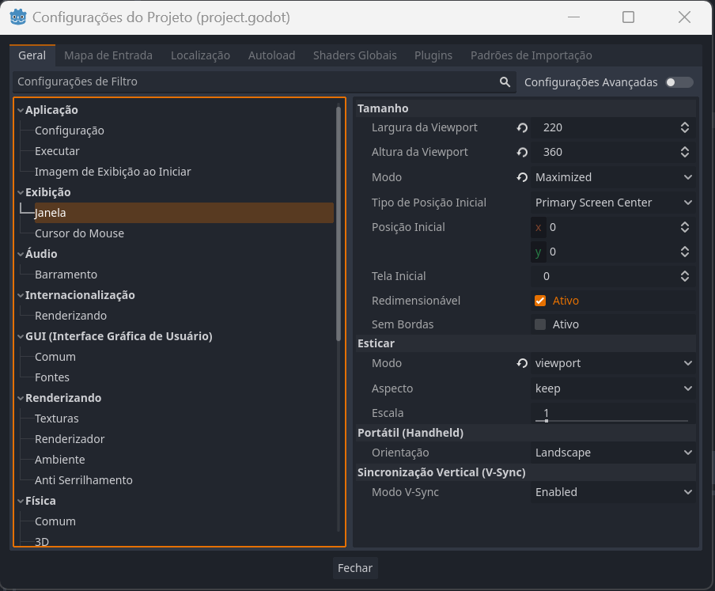

<h1>CRIAÇÃO DA CENA MAIN 🧾</h1>
1- Adicione uma nova cena 2d na pasta cenas, e nomeie ela como main.tscn

2- selecione o nó da cena e clique no botão de adicionar script 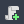, e coloque o mesmo nome que foi colocado na cena "main.gd"
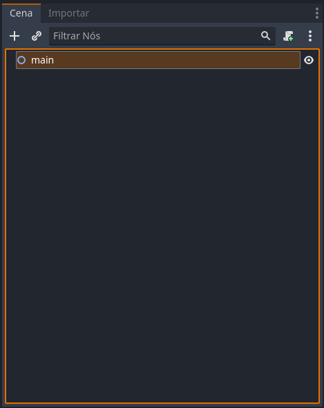

3- clique no botao  e adicione 2 Static Body2d
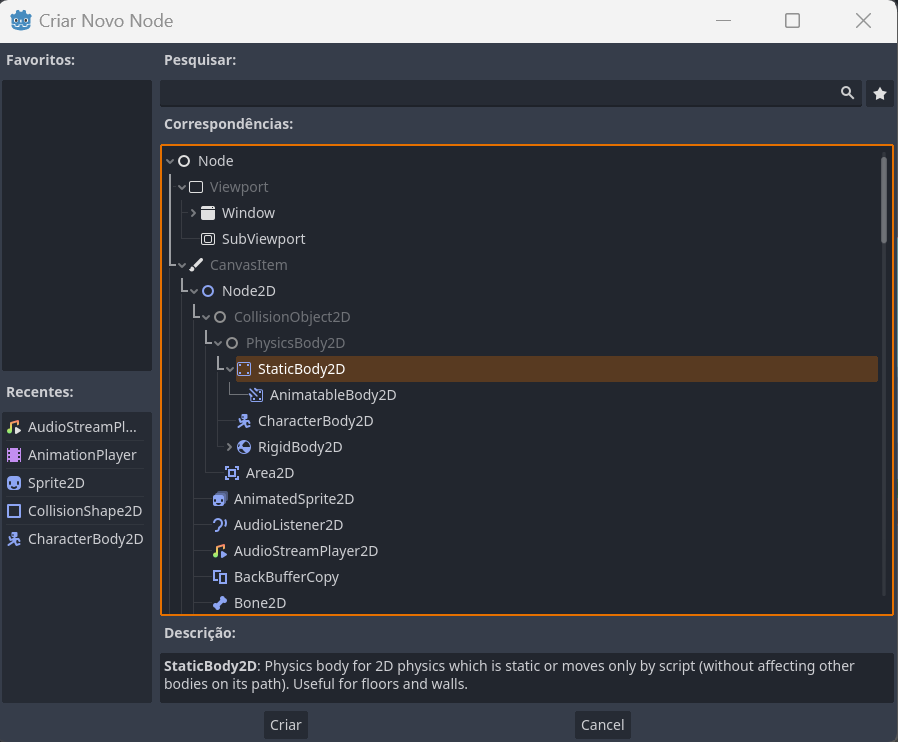

4- nomeie os Static Body2d como "teto" e "chao", então adicione dentro de cada um deles, um CollisionShape2d
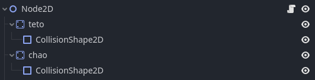

5- ao clicar em um dos CollisionShape2d criados, clique no dropdown "[vazio]" e selecione a opção "novo rectangle shape"

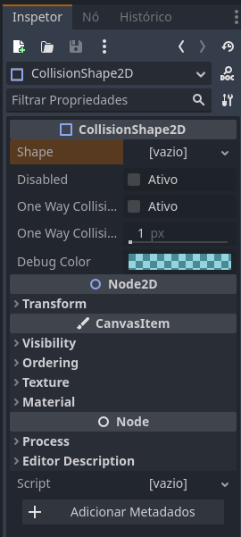

6- repita o processo para o outro CollisionShape2d e posicione as hitboxes criadas da seguinte forma
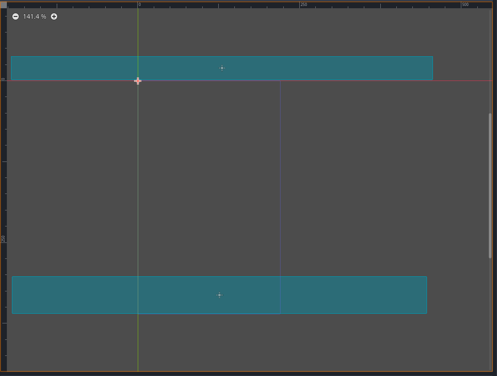

<h1>ADICIONANDO O PERSONAGEM A CENA MAIN 🧾</h1>
1- Dentro da pasta cenas, crie uma cena chamada personagem

2- Mude o tipo da cena para CharacterBody2d

3- Dentro da cena, adicione:
- Um Sprite 2d
- Dois AudioStreamPlayer
- Um AnimationPlayer

*Ignore o CollisionPolygon por enquanto
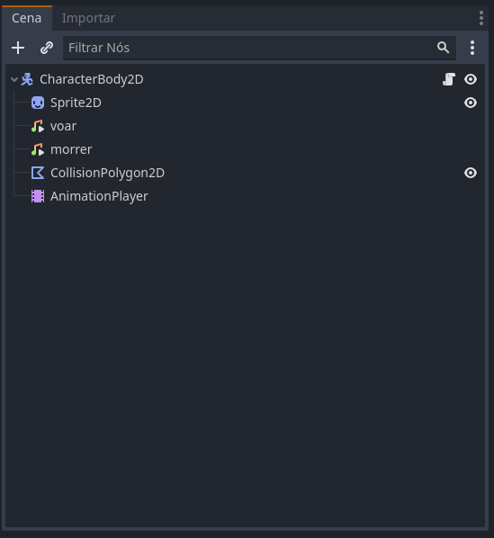

4- Clicando no Sprite2d, adicione o sprite do flappy bird

5- No canto direito, procure pela aba Animation, e configure os Vframes como 3

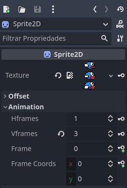

6- Um pouco abaixo, encontre a aba Transform, então configure a Scale.x e Scale.y para 0.09

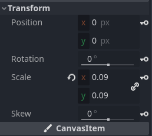

7- Adicione um CollisionPolygon e desenhe a hitbox do personagem de acordo com a sprite, ou se preferir, adicione uma CollisionShape2d convencional

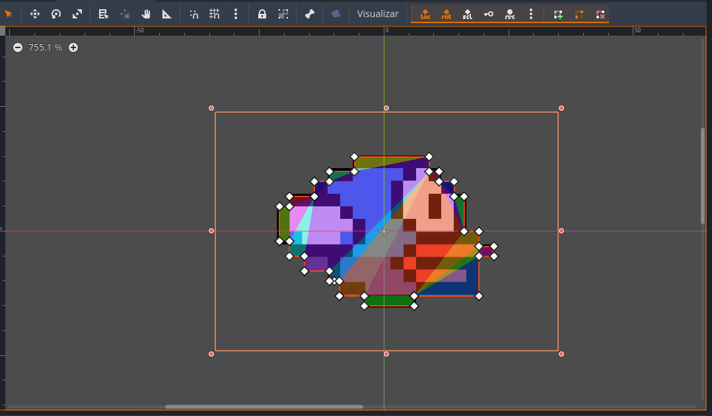

8- Dentro do AnimationPlayer, entre na aba Root Node e selecione o CharacterBody2d

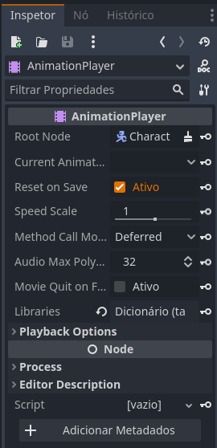

9- Na aba localizada no canto infeiror

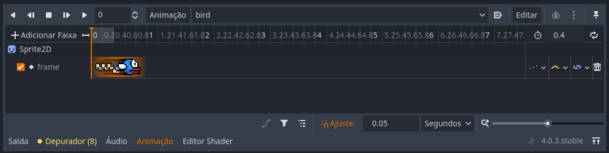

10- Clique no botão Animação e crie uma nova animação e crie uma animação com o nome de bird

11- Configure o tempo da animação para 0.4s

12- Configure o ajuste para 0.05s

13- Clique na aba animation
- No campo Frame, clique na chave branca com um simbolo de "+" verde

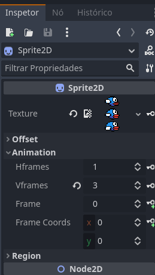

14- Mude para o frame 1 e aperte novamente a chave

15- Termine a animação, com a seguinte sequencia de frames: 0 - 1 - 0 - 1 - 0 - 1 - 2 - 1 - 0

16- Dentro do CharacterBody2d, adicione um script e adicione o seguinte código:

```Python
extends CharacterBody2D


const SPEED = 300.0
const JUMP_VELOCITY = -320.0

var vida = 1


# Usando as configurações padrões de velocidade do Godot
var gravity = ProjectSettings.get_setting("physics/2d/default_gravity")


func _physics_process(delta): 

    # Checando se a variável global vida é true
	if Global.vida:
        # Verificando se o personagem colidiu
		if is_on_ceiling() or is_on_wall() or is_on_floor():
            # Definindo a variavel Global.vida como false
			Global.vida = 0
			vida = 0
			$morrer.play()
			
		if not is_on_floor():
			velocity.y += gravity * delta

		# Checando se o jogador pressionou a barra de espaço
		if Input.is_action_just_pressed("ui_accept"):
			velocity.y = JUMP_VELOCITY
			$AnimationPlayer.play("bird")
			$voar.play()

        # Checando se o personagem está subindo
		if velocity.y < 90:
            # Rotacionar o pássaro
			if self.rotation > -.8:
				self.rotation -= 10 * delta

    # Em caso do personagem colidir, definir a velocidade vertical como 300, para permitir que o personagem caia
	else:
		velocity.y = 300

    # Checando se o personagem está caindo
	if velocity.y > 90:
        # Rotacionar o pássaro para baixo
		if self.rotation < 1:
			self.rotation += 4 * delta

	
	move_and_slide()

```

17- Dentro do Script Global.gd, adicione o seguinte código:

```Python
extends Node


var vida = true

var pontos = 0
var fase = 0
var recorde = 0

var novo_recorde = false

```

18- Dentro dos AudioStreamPlayers, adicione os respectivos aquivos e desmarque a opção Autoplay, Playing e Stream Paused

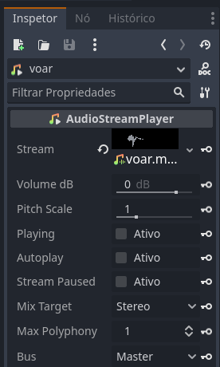

19- Agora você pode entrar na cena main e arrastar a cena personagem para dentro dela


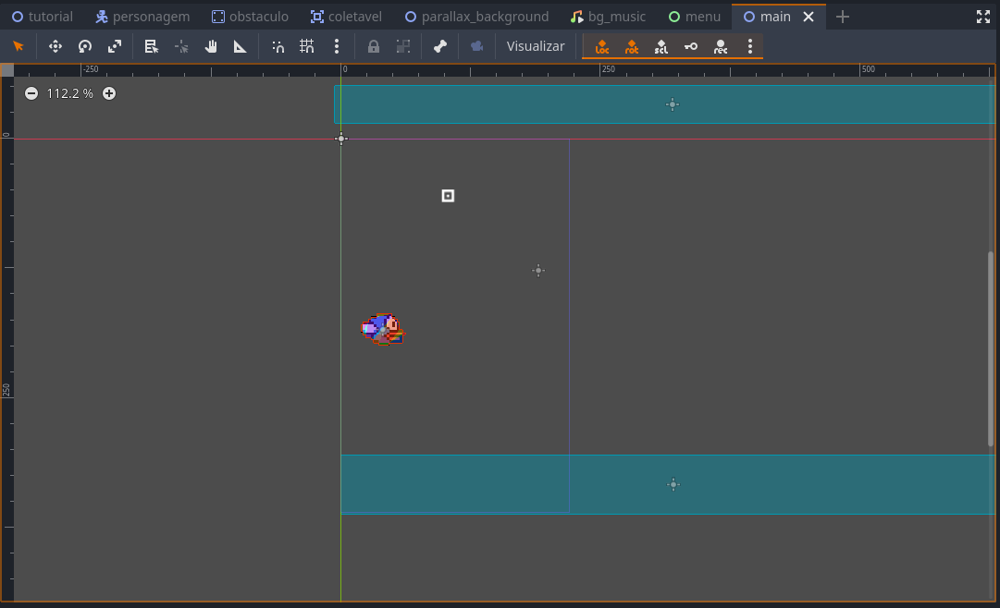

<h1>ADICIONANDO PARALAX BACKGROUND 🧾</h1>
1- Crie uma nova cena paralax_background

2- Adicione um ParalaxBackground

3- Organize a estrutura desta cena assim

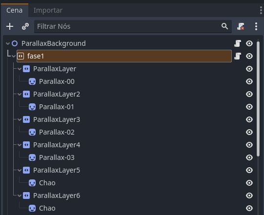

4- Adicione cada imagem de paralax com seu respectivo Sprite2d

5- Monte a cena da seguinte forma

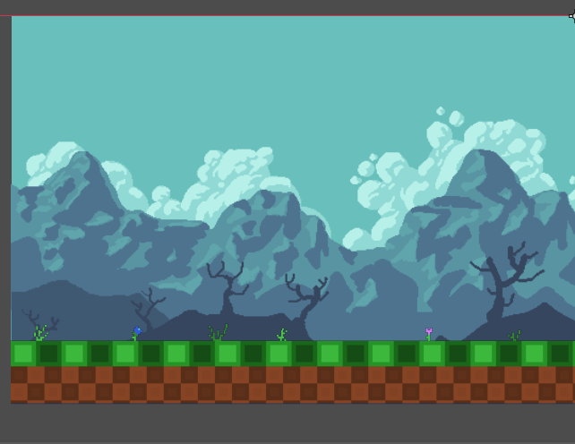

6- Clicando no parallaxLayer0, configure o motion da seguinte forma

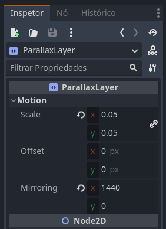

7- Refaça o mesmo para os outros ParalaxLayers, mas alterando o scale de cada para
- Parallax-01: 0.05
- Parallax-02: 0.3
- Parallax-03: 0.5 
- Chao: 1

8- Adicione um script na fase 1
```Python
extends ParallaxBackground


var background: Vector2 = Vector2()


func _ready():
	pass 


func _process(_delta):
    # Este codigo faz com que o fundo ande automaticamente caso o jogador esteja vivo
	if Global.vida:
		background.x -= 2
		set_scroll_offset(background)

```

9- adicione a cena dentro da main

<h1>ADICIONANDO COLETÁVEL, OBSTÁCULOS E PONTUAÇÕES 🧾</h1>

1- Crie uma nova Cena chamada de obstaculo do tipo Static body2d, e organize desta forma
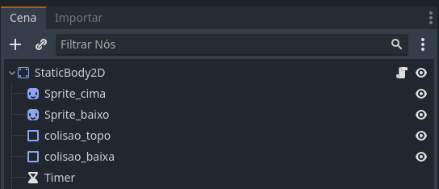

2- Adicione as imagens de obstaculo em cada um dos spites e posicione os obstaculos da seguinte forma
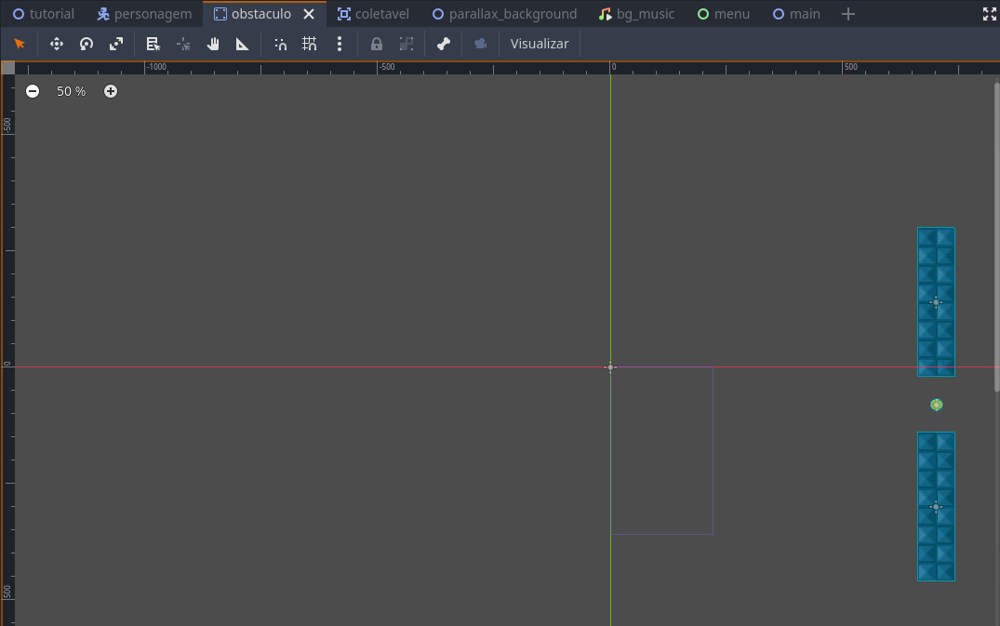

3- Adicione este script dentro do StacticBody2d

```Python
extends StaticBody2D


func _ready():
	if Global.vida:
		randomize()
		var y_range = Vector2(0, 150)
		var random_y =  randi() % int(y_range[1]-y_range[0]) + 1 + y_range[0]
		self.position.y = random_y


# Called every frame. 'delta' is the elapsed time since the previous frame.
func _process(delta):
	if Global.vida:
		self.position.x -= 2

```

4- Crie uma nova cena chamada obstaculo, do tipo Area2d

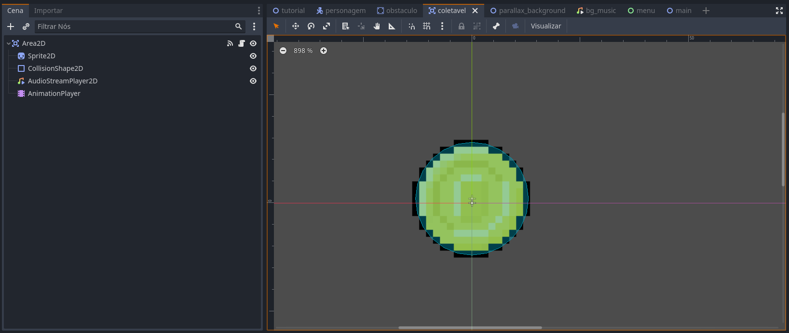

5- Configure os frames da sprite da moeda e altere a scale da imagem para 0.16

6- Crie uma animação chamada coin dentro do animation player

7- Coloque uma CollisionShape na moeda

8- Adicione este script dentro da Area2d
```Python
extends Area2D


var ponto = 1


func _on_body_entered(body):
	if ponto and Global.vida:
		$AudioStreamPlayer2D.play()
		Global.pontos += 1
		self.hide()
		ponto = 0

func _process(delta):
	$AnimationPlayer.play("coin")

```
9- Com a Area2d selecionada, va na aba Nó e selecione body_entered

10- Voltando para a cena obstáculo, coloque a moeda criada entre os 2 obstáculos

11- Na cena main, adicione um Timer e uma Label

12- No timer, adicione um nó de Timeout apontando para o Node2d

13- Para chamar os obstáculos na main, ao invés de colocarmos dentro da cena, criaremos este script dentro de Node2d

```Python
extends Node2D


var MyNode = preload("res://cenas/obstaculo.tscn")
var delay = 2


func criar_item():
	var obstaculo = MyNode.instantiate()
	add_child(obstaculo)
	$Timer.start(delay)

func _ready():
	criar_item()

func _on_timer_timeout():
	criar_item()
	$Timer.start(delay)

	
func _process(delta):
	$Label.text = str(Global.pontos)

```

<h1>ADICIONANDO TELA DE PLAY/GAME OVER 🧾</h1>
1- Crie uma nova cena chamada menu

2- organize ela da seguinte forma

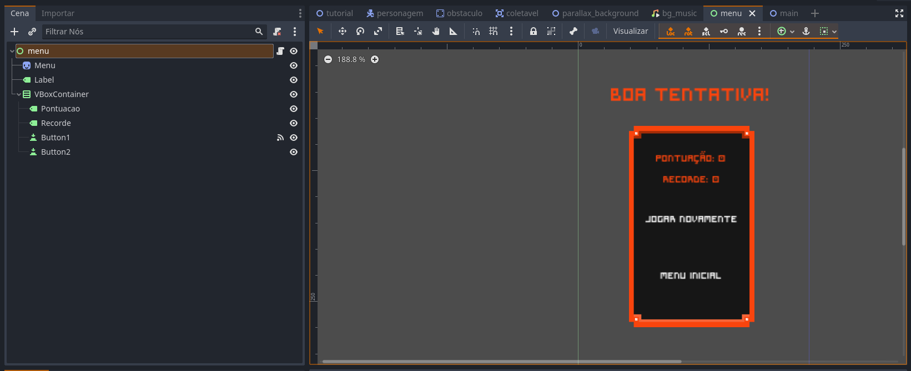

3- Configure o botão jogar novamente da seguinte forma

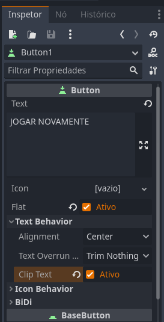

4- Adicione um nó pressed no nó principal "menu"

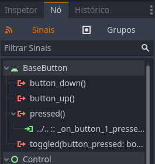

5- Adicione este script no node menu

```Python
extends Control


func _on_button_1_pressed():
	Global.vida = true
	Global.pontos = 0
	Global.novo_recorde = false
	get_tree().change_scene_to_file("res://cenas/tutorial.tscn")

func _process(delta):
	$VBoxContainer/Recorde.text = str("Recorde atual: ",Global.recorde)
	$VBoxContainer/Pontuacao.text = str("Pontuação: ",Global.pontos)
	
	if Global.novo_recorde:
		$Label.text = "Novo recorde!"

```

6- Crie uma cena chamada tutorial e monte ela desta forma
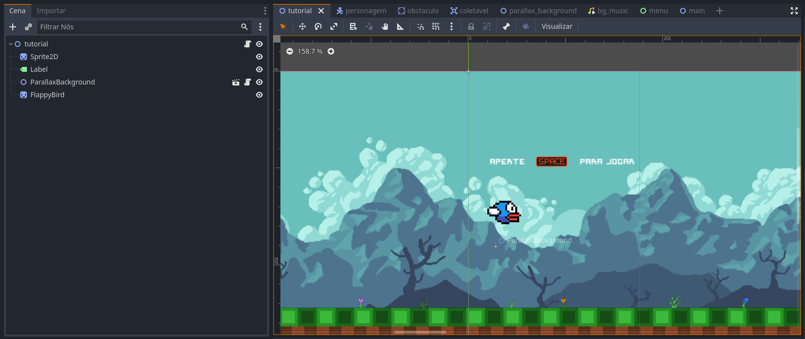

7- Insira este script dentro do node Tutorial
```Python
extends Node2D


func _ready():
	
	var range_color = Vector2(0, 3)
	
	randomize()
	Global.red =  randi() % int(range_color[1]-range_color[0]) + 1 + range_color[0]
	
	randomize()
	Global.green =  randi() % int(range_color[1]-range_color[0]) + 1 + range_color[0]
	
	randomize()
	Global.blue =  randi() % int(range_color[1]-range_color[0]) + 1 + range_color[0]
	
	$FlappyBird.modulate = Color(Global.red, Global.green, Global.blue, 1)
	
	
	
	
# Called every frame. 'delta' is the elapsed time since the previous frame.
func _process(delta):
	if Input.is_action_just_pressed("ui_accept"):
		Global.vida = true
		Global.pontos = 0
		Global.novo_recorde = false
		get_tree().change_scene_to_file("res://cenas/main.tscn")

```
